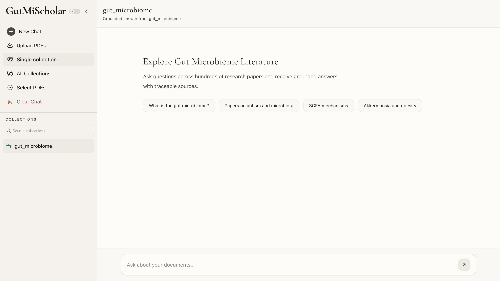
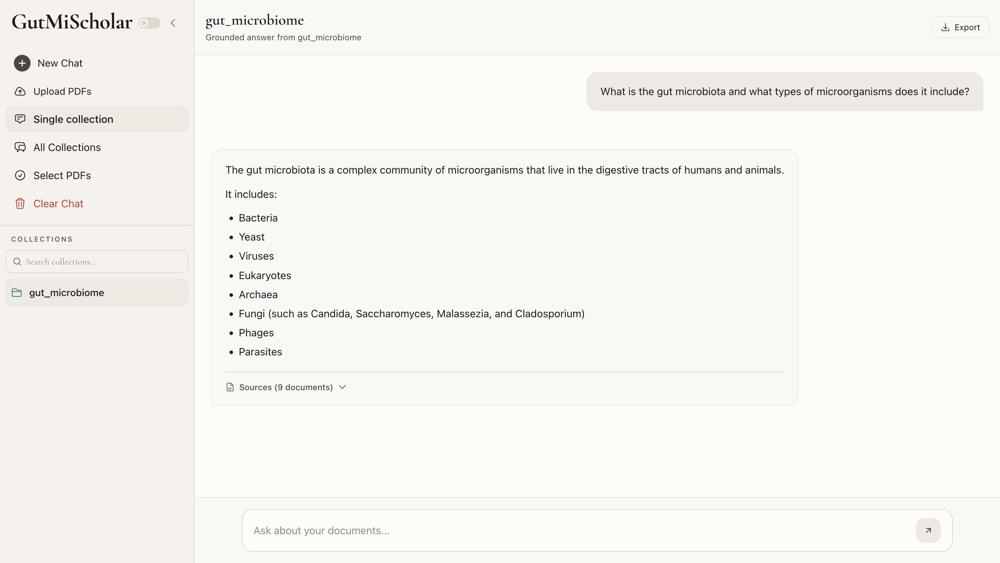
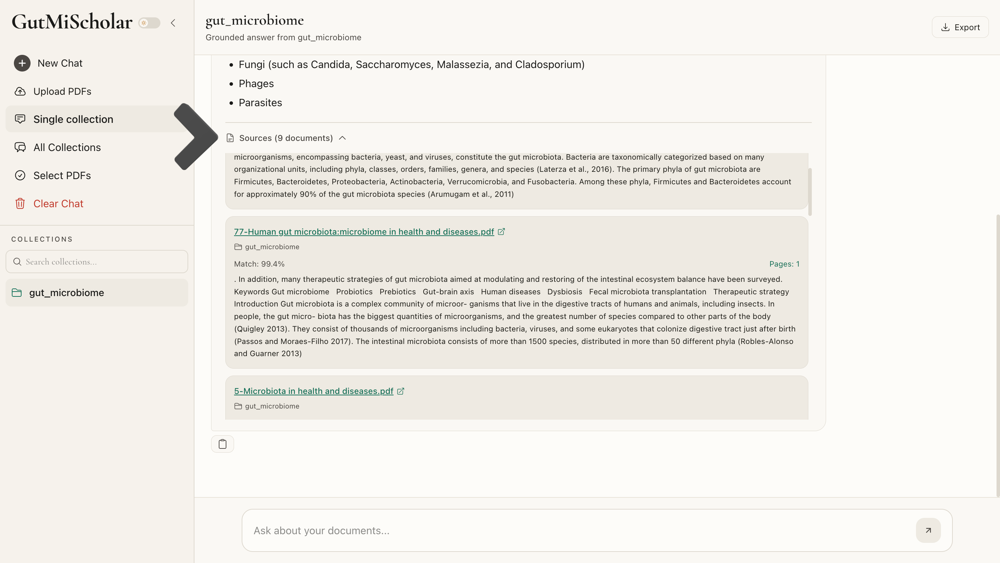
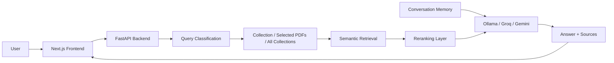

# GutMiScholar

A literature-grounded question answering system for scientific research papers.

GutMiScholar enables researchers to interact with collections of scientific PDFs using natural language. Documents are indexed into a vector database, relevant passages are retrieved and reranked, and answers are generated from retrieved context while preserving traceability to the underlying literature.



---

## Table of Contents

* Overview
* Screenshots
* Features
* Retrieval Modes
* Architecture
* Evaluation
* Documentation
* Technology Stack
* Supported LLM Providers
* Quick Start
* Docker Deployment
* Data Privacy
* License

---

## Overview

Scientific literature is growing faster than researchers can realistically read.

GutMiScholar helps researchers search, explore, and question large collections of scientific papers through natural language while maintaining links back to the original source material.

Instead of manually opening dozens of PDFs, users can query an indexed literature collection and receive answers grounded in retrieved passages from the underlying papers.

---

## Screenshots

### Query Interface



### References



---

## Features

| Feature | Description |
|----------|-------------|
| Collection-Based Search | Search within a single collection, across all collections, or a selected subset of PDFs |
| Query Classification | Automatically routes queries to the appropriate workflow |
| Source-Grounded Answers | Responses include references to retrieved literature |
| Configurable Reranking | Supports similarity-based, cross-encoder, and LLM-based reranking |
| Multiple LLM Providers | Ollama, Groq, and Gemini |
| Conversation Memory | Maintains context across multi-turn conversations |
| Streaming Responses | Real-time answer generation using Server-Sent Events (SSE) |
| Conversation Export | Export chats as Markdown, Text, or PDF |

---

## Retrieval Modes

GutMiScholar supports multiple retrieval scopes depending on the research task.

| Mode | Description |
|--------|------------|
| Single Collection | Search within a specific collection |
| All Collections | Search across all available collections |
| Selected PDFs | Search only selected PDFs |

---

## Architecture



GutMiScholar combines query classification, collection-aware retrieval, configurable reranking, conversation memory, and source-grounded answer generation into a single literature exploration workflow.

---

## Evaluation

GutMiScholar includes a reproducible evaluation pipeline built using RAGAS and a curated benchmark derived from gut microbiome research papers.

The evaluation workflow supports:

- MCQ-based accuracy evaluation
- Open-ended answer evaluation with RAGAS
- Retrieval quality analysis
- Error analysis and score distribution reports
- Local LLM-based evaluation through Ollama

See:

- `docs/EVALUATION.md`
- `docs/EVAL_DATASET.md`
- `docs/EVAL_PIPELINE.md`
- `docs/EVAL_RESULTS.md`

---

## Documentation

Detailed documentation is available in the `docs/` directory.

| Document | Description |
|-----------|-------------|
| `docs/ARCHITECTURE.md` | System architecture, retrieval workflows, service design, and deployment architecture |
| `docs/API.md` | REST API reference, request/response formats, and endpoint documentation |
| `docs/EVALUATION.md` | Evaluation methodology, RAGAS metrics, and benchmark design |
| `docs/EVAL_DATASET.md` | Dataset generation workflow and benchmark structure |
| `docs/EVAL_PIPELINE.md` | End-to-end evaluation pipeline and reproduction guide |
| `docs/EVAL_RESULTS.md` | Benchmark results, RAGAS scores, and evaluation analysis |

---

## Technology Stack

### Backend

* FastAPI
* ChromaDB
* LangChain
* Sentence Transformers
* Uvicorn

### Retrieval & Ranking

* Semantic Vector Search
* Cross-Encoder Reranking
* LLM-Based Reranking

### Frontend

* Next.js
* React
* TypeScript
* Tailwind CSS

### Infrastructure

* Docker
* Docker Compose

---

## Supported LLM Providers

| Provider | Mode  | Use Case                      |
| -------- | ----- | ----------------------------- |
| Ollama   | Local | Offline and private inference |
| Groq     | Cloud | Low-latency inference         |
| Gemini   | Cloud | Hosted inference              |

---

## Quick Start

### Clone Repository

```bash
git clone https://github.com/KAMRANKHANALWI/GutMiScholar
cd GutMiScholar
```

### Backend Setup

```bash
cd backend

uv sync
cp .env.example .env
```

Configure environment variables:

```env
GROQ_API_KEY=your_key
GOOGLE_API_KEY=your_key

GROQ_MODEL=llama-3.1-8b-instant
RERANKER_API_PROVIDER=gemini

USE_LOCAL_LLM=true
OLLAMA_MODEL=llama3.1:latest
```

Start the backend:

```bash
./development.sh
```

Backend:

```text
http://localhost:8000
```

API Documentation:

```text
http://localhost:8000/docs
```

### Frontend Setup

```bash
cd frontend

npm install
npm run dev
```

Frontend:

```text
http://localhost:3000
```

---

## Docker Deployment

Build and start services:

```bash
docker compose up --build -d
```

View running containers:

```bash
docker ps
```

Stop services:

```bash
docker compose down
```

---

## Data Privacy

GutMiScholar supports both local and cloud-based inference.

When using Ollama:

* Documents remain on the local machine
* Retrieval and generation run locally
* No document content is sent to external model providers

When using Groq or Gemini, retrieved document context is sent to the configured provider for answer generation.

---

## License

MIT License
