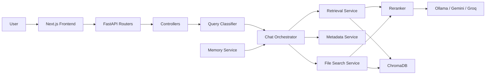
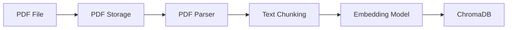
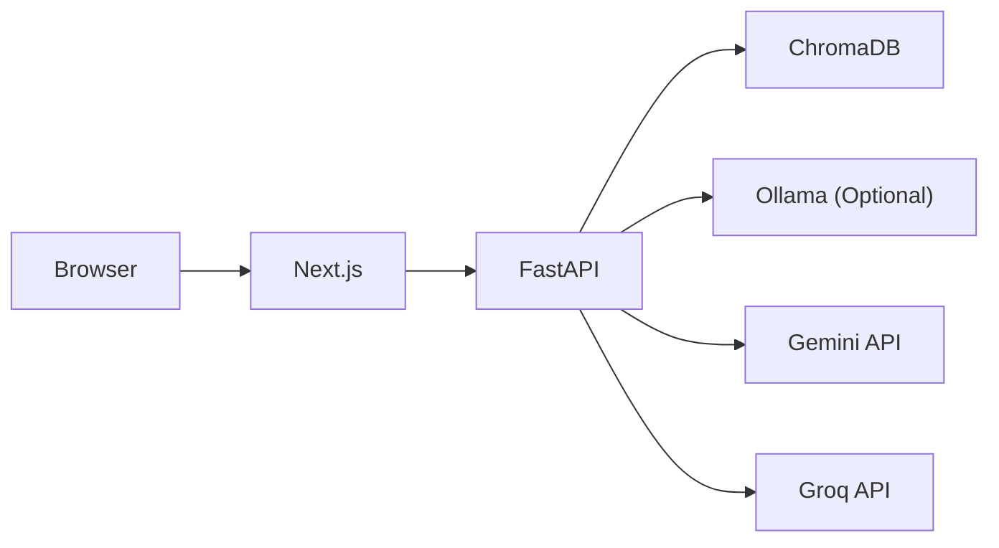

# System Architecture

This document describes the architecture of GutMiScholar and the flow of data from document ingestion to answer generation.

---

# Overview

GutMiScholar is a literature-grounded question answering system for scientific PDFs.

The system allows users to upload research papers, organize them into collections, retrieve relevant passages through semantic search, and generate answers grounded in retrieved literature.

The architecture is organized into layers responsible for:

* User interaction
* Request handling
* Query processing
* Document retrieval
* Reranking
* Language model inference
* Source attribution

---

# Architectural Principles

The system is designed around the following principles:

* Retrieval before generation
* Collection-oriented document organization
* Configurable model providers
* Local-first deployment support
* Transparent source attribution
* Modular service design
* Streaming responses

---

# High-Level Architecture



---

# Frontend Architecture

The frontend is implemented using Next.js, React, TypeScript, and Tailwind CSS.

Responsibilities include:

* Collection management
* PDF uploads
* PDF selection workflows
* Chat interface
* Source display
* Streaming response rendering
* Conversation export

The frontend communicates with the backend through REST APIs and Server-Sent Events (SSE).

---

# Backend Architecture

The backend is implemented using FastAPI.

The backend follows a layered architecture:

```text
Routers
    ↓
Controllers
    ↓
Orchestrators
    ↓
Services
```

---

## Routers

Routers expose HTTP endpoints and validate incoming requests.

Examples:

* chat.py
* collections.py
* search.py
* metadata.py
* selection.py

Routers do not contain retrieval or generation logic.

---

## Controllers

Controllers handle request processing and response formatting.

Examples:

* chat_controller.py
* selection_controller.py

Responsibilities include:

* Query classification
* Workflow selection
* Response streaming setup
* Delegation to orchestrators and services

---

## Orchestrators

Orchestrators coordinate workflows involving multiple services.

Current orchestrator:

* chat_orchestrator.py

Responsibilities:

* Metadata workflows
* File-specific workflows
* Prompt construction
* Conversation history integration
* Source preparation
* Response streaming

---

## Services

Services contain the core application logic.

Examples:

* retrieval_service.py
* metadata_service.py
* memory_service.py
* pdf_selection_service.py
* collection_manager.py
* document_processor.py
* file_search_service.py

Services remain independent and reusable.

---

# Document Ingestion Pipeline

Documents must be processed before they become searchable.



---

## PDF Storage

Uploaded documents are stored under the configured data directory.

The storage layer manages:

* File persistence
* Collection organization
* Upload validation

---

## PDF Parsing

PDF content is extracted using PyMuPDF.

Extracted metadata includes:

* Filename
* Page numbers
* Collection name

---

## Chunking

Documents are divided into overlapping chunks before embedding.

Default configuration:

```text
Chunk Size: 1000
Chunk Overlap: 200
```

Chunking improves retrieval granularity and retrieval quality.

---

## Embeddings

Text chunks are converted into vector representations using Sentence Transformers.

Default model:

```text
all-MiniLM-L6-v2
```

---

## Vector Storage

Embedded chunks are stored in ChromaDB.

Each collection maintains its own vector index and associated metadata.

---

# Query Processing Pipeline

Every user query follows the workflow below.

```text
User Query
    ↓
Router
    ↓
Controller
    ↓
Query Classification
    ↓
Workflow Selection
    ↓
Orchestrator
    ↓
Retrieval (if required)
    ↓
Reranking
    ↓
Prompt Construction + Conversation History
    ↓
LLM
    ↓
Streaming Response
```

The controller classifies incoming queries and selects the appropriate workflow.

Metadata-oriented queries are handled directly without retrieval.

Content-oriented queries continue through retrieval, reranking, prompt construction, and answer generation.

---

# Query Classification Layer

Before retrieval begins, the system classifies user intent.

Supported classifications currently include:

* content_search
* file_specific_search
* list_pdfs
* count_pdfs
* list_collections

Content-oriented classifications continue through retrieval and answer generation workflows.

Metadata-oriented classifications are handled directly without retrieval or reranking.

---

# Retrieval Layer

The retrieval layer performs semantic search against ChromaDB.

Retrieved chunks contain:

* Content
* Filename
* Collection
* Page numbers
* Similarity score

The retrieval strategy depends on the active retrieval mode.

---

# Reranking Layer

Initial retrieval prioritizes recall.

A reranking stage is applied before answer generation to improve relevance.

Available reranking strategies include:

* Similarity-based ranking
* Cross-encoder reranking
* LLM-based reranking

The active strategy is selected through configuration.

---

# LLM Layer

GutMiScholar supports multiple inference providers.

## Ollama

Local inference.

Suitable for:

* Private deployments
* Sensitive documents
* Offline usage

Document content remains within the local environment.

---

## Groq

Cloud-hosted inference focused on low-latency generation.

---

## Gemini

Cloud-hosted inference through Google Gemini models.

---

## Provider Selection

The active provider is selected through configuration.

Switching providers does not require application code changes.

---

# Conversation Memory

The memory layer stores conversation history used during answer generation.

Responsibilities include:

* Conversation context preservation
* Multi-turn interaction support
* Prompt enrichment

Conversation history is retrieved independently from document retrieval and incorporated during prompt construction before answer generation.

---

# Retrieval Modes

Content retrieval can operate at different scopes.

---

## Single Collection

Searches only the active collection.

```text
User Query
    ↓
Selected Collection
    ↓
Retrieval
    ↓
Reranking
    ↓
Answer
```

This mode provides the most focused retrieval scope.

---

## All Collections

Searches across every available collection.

```text
User Query
    ↓
All Collections
    ↓
Retrieval
    ↓
Reranking
    ↓
Answer
```

This mode is useful when relevant information may exist across multiple collections.

---

## Selected PDFs

Searches only user-selected PDFs.

```text
User Query
    ↓
Selected PDFs
    ↓
Retrieval
    ↓
Reranking
    ↓
Answer
```

This mode allows targeted exploration of specific documents.

---

# Source Attribution

Generated answers include references to retrieved passages.

Source attribution enables users to:

* Verify generated responses
* Inspect supporting evidence
* Trace information back to source documents

The system is designed to keep generated responses connected to retrieved literature.

---

# Response Streaming

Chat responses are delivered using Server-Sent Events (SSE).

The backend streams source references and generated content incrementally.

The frontend accumulates incoming content chunks and progressively updates the chat interface, producing a real-time streaming experience similar to modern conversational AI systems.

Benefits include:

* Progressive answer rendering
* Reduced perceived latency
* Continuous response updates

---

# Deployment Architecture

The application can be deployed locally or through Docker.



Docker Compose orchestrates the frontend and backend services.

---

# Configuration

The application is configured through environment variables.

Examples include:

```text
USE_LOCAL_LLM
DEFAULT_MODEL_PROVIDER

OLLAMA_MODEL
GROQ_MODEL
GEMINI_MODEL

RERANKER_TYPE

TOP_K
TOP_K_CHATALL

CHUNK_SIZE
CHUNK_OVERLAP

MAX_HISTORY
```

Configuration changes do not require application code modifications.

---

# Design Goals

The architecture was designed around the following goals:

* Literature-grounded responses
* Collection-based retrieval
* User-controlled retrieval scope
* Configurable model providers
* Local-first deployment support
* Transparent source attribution
* Streaming responses
* Modular retrieval pipeline

These goals guided the architectural decisions throughout the system.
