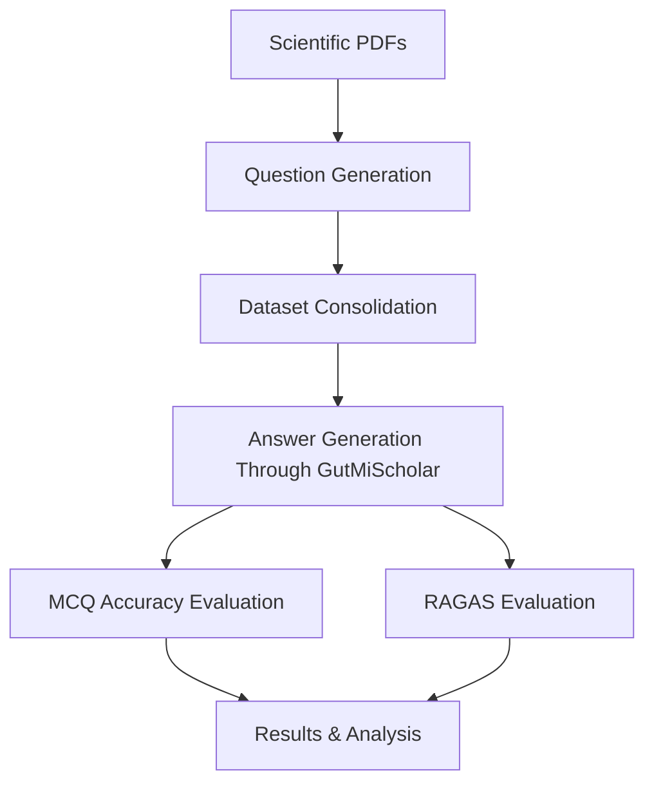

# Evaluation Pipeline

This document explains how to reproduce the complete GutMiScholar evaluation workflow.

The evaluation pipeline measures both retrieval quality and answer generation quality using a combination of Multiple Choice Questions (MCQs) and open-ended questions.

---

# Pipeline Overview

The evaluation workflow consists of seven stages.



---

# Evaluation Directory Structure

```text
src/eval/

├── Eval_Data/
│
├── Eval_Dataset_New/
│
├── Eval_Results/
│
├── process_json_dataset.py
│
├── rag_mcq.py
├── rag_open_ended.py
│
├── eval_mcq.py
├── eval_open_ended_ragas.py
│
├── summarize_mcq_ragas.py
├── summarize_open_ended_ragas.py
│
├── consolidated_eval_results.py
├── eval_score_distribution.py
```

---

# Stage 1 — Create Evaluation Dataset

The evaluation process begins with paper-level datasets.

Each scientific paper is converted into a JSON dataset containing:

- Open-ended questions
- Multiple choice questions
- Reference answers
- Difficulty labels

Example:

```text
Eval_Data/

1-Paper.json
2-Paper.json
3-Paper.json
...
```

Each file corresponds to a single research paper.

---

# Stage 2 — Consolidate Datasets

Individual paper datasets are merged into a unified benchmark.

Run:

```bash
python -m src.eval.process_json_dataset
```

Generated files:

```text
Eval_Dataset_New/

gut_microbiome_dataset.json

gut_microbiome_full_dataset.csv

gut_microbiome_mcq.csv

gut_microbiome_open_ended.csv
```

Purpose:

- Creates a single evaluation benchmark
- Splits MCQ and open-ended datasets
- Produces CSV files used by downstream evaluation scripts

---

# Stage 3 — Generate RAG Answers

The next stage runs evaluation questions through the actual GutMiScholar backend.

This is important because the evaluation uses the same retrieval, reranking, prompting, and generation pipeline used by end users.

---

## MCQ Generation

Run:

```bash
python -m src.eval.rag_mcq
```

Input:

```text
gut_microbiome_mcq.csv
```

Output:

```text
Eval_Results/

rag_outputs_mcq.csv
```

For each MCQ:

```text
Question
     ↓
GutMiScholar Retrieval
     ↓
Reranking
     ↓
Answer Generation
     ↓
Save Output
```

Stored fields include:

- Generated answer
- Retrieved contexts
- Retrieved sources
- Similarity score

---

## Open-Ended Generation

Run:

```bash
python -m src.eval.rag_open_ended
```

Input:

```text
gut_microbiome_open_ended.csv
```

Output:

```text
Eval_Results/

rag_outputs_open_ended.csv
```

Stored fields include:

- Generated answer
- Retrieved contexts
- Retrieved sources
- Similarity score

---

# Stage 4 — Evaluate MCQs

MCQ evaluation does not use RAGAS.

Instead, the generated answer is parsed and compared against the ground-truth option.

Run:

```bash
python -m src.eval.eval_mcq
```

Output:

```text
Eval_Results/

mcq_eval_results.csv
```

Evaluation logic:

```text
Model Answer
      ↓
Extract Option (A/B/C/D)
      ↓
Compare With Ground Truth
      ↓
Correct / Incorrect
```

Metric:

```text
Accuracy
```

---

# Stage 5 — Evaluate Open-Ended Questions

Open-ended questions are evaluated using RAGAS.

Run:

```bash
python -m src.eval.eval_open_ended_ragas
```

Output:

```text
Eval_Results/

open_ended_eval_results.csv
```

The evaluation uses:

- Generated answer
- Retrieved contexts
- Reference answer

to compute RAGAS metrics.

---

# RAGAS Metrics

The following metrics are computed.

## Faithfulness

Measures whether the answer is supported by retrieved context.

---

## Answer Relevancy

Measures whether the answer addresses the question.

---

## Answer Correctness

Measures semantic similarity between generated and reference answers.

---

## Context Precision

Measures how much retrieved context is relevant.

---

## Context Recall

Measures whether retrieved context contains the information needed to answer the question.

---

# Local Evaluation Model

By default, GutMiScholar uses a local Ollama model as the RAGAS judge.

Example:

```text
Llama 3.1 70B
```

Benefits:

- No API costs
- Offline evaluation
- Improved privacy
- Reproducible results

The evaluation model can be changed through configuration.

---

# Stage 6 — Generate Summary Reports

After evaluation completes, aggregate reports are generated.

---

## MCQ Summary

Run:

```bash
python -m src.eval.summarize_mcq_ragas
```

Output:

```text
mcq_eval_summary.json
```

Contains:

- Accuracy
- Correct answers
- Incorrect answers
- Dataset coverage

---

## Open-Ended Summary

Run:

```bash
python -m src.eval.summarize_open_ended_ragas
```

Output:

```text
open_ended_eval_summary.json
```

Contains:

- Average metric scores
- Standard deviations
- Dataset coverage

---

# Stage 7 — Error Analysis

The final stage helps identify weak-performing questions.

---

## Merge Evaluation Data

Run:

```bash
python -m src.eval.consolidated_eval_results
```

Output:

```text
consolidated_eval_results.csv
```

This combines:

- Questions
- Generated answers
- Contexts
- References
- Evaluation scores

into a single dataset.

---

## Score Distribution Analysis

Run:

```bash
python -m src.eval.eval_score_distribution
```

Generated outputs:

```text
evaluation_summary.json

correctness_distribution.json

low_correctness_*.csv

high_correctness_*.csv

plots/
```

---

# Generated Visualizations

The analysis script produces:

```text
1_histogram.png
2_boxplot.png
3_cdf.png
4_quality_buckets.png
5_bucket_distribution.png
```

These visualizations help identify:

- Retrieval failures
- Weak answers
- Distribution of answer correctness
- Overall system quality

---

# Running the Full Pipeline

Typical workflow:

```bash
# 1. Consolidate datasets
python -m src.eval.process_json_dataset

# 2. Generate MCQ answers
python -m src.eval.rag_mcq

# 3. Generate open-ended answers
python -m src.eval.rag_open_ended

# 4. Evaluate MCQs
python -m src.eval.eval_mcq

# 5. Evaluate open-ended questions
python -m src.eval.eval_open_ended_ragas

# 6. Generate summaries
python -m src.eval.summarize_mcq_ragas
python -m src.eval.summarize_open_ended_ragas

# 7. Merge outputs
python -m src.eval.consolidated_eval_results

# 8. Generate analytics
python -m src.eval.eval_score_distribution
```

All commands should be executed from the backend root directory.

Example:

```bash
cd backend

python -m src.eval.rag_mcq
```

instead of:

```bash
cd src/eval

python rag_mcq.py
```

This ensures imports resolve correctly and the evaluation uses the same application configuration as the main GutMiScholar backend.

---

# Reproducibility

The evaluation pipeline is designed to reuse the production retrieval pipeline.

The same components used during normal chatbot operation are also used during evaluation:

- ChromaDB retrieval
- Query classification
- Retrieval service
- Reranking layer
- Prompt construction
- LLM generation

This ensures that evaluation results reflect real application behavior rather than a separate testing implementation.
